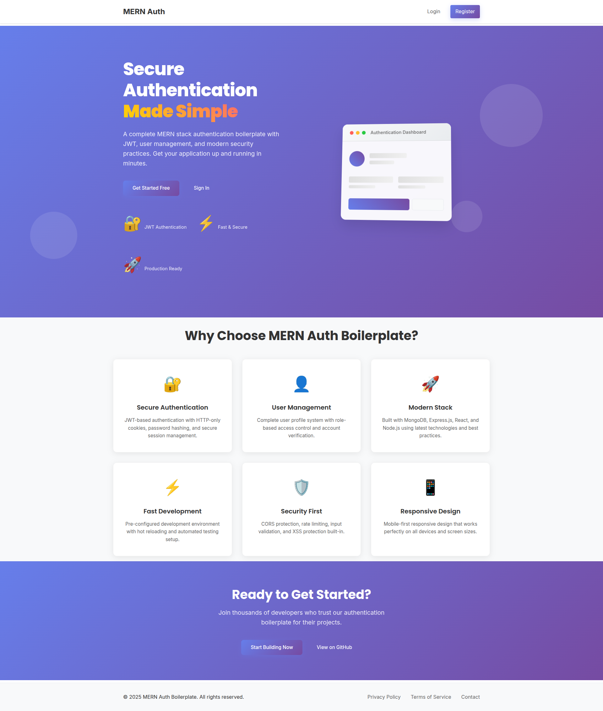
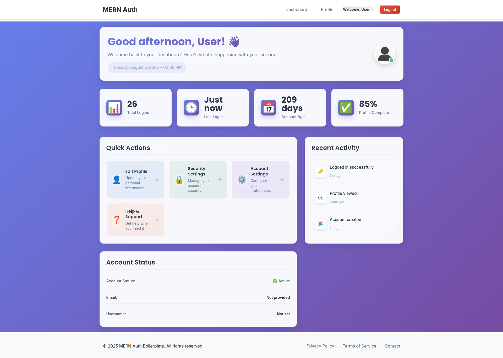
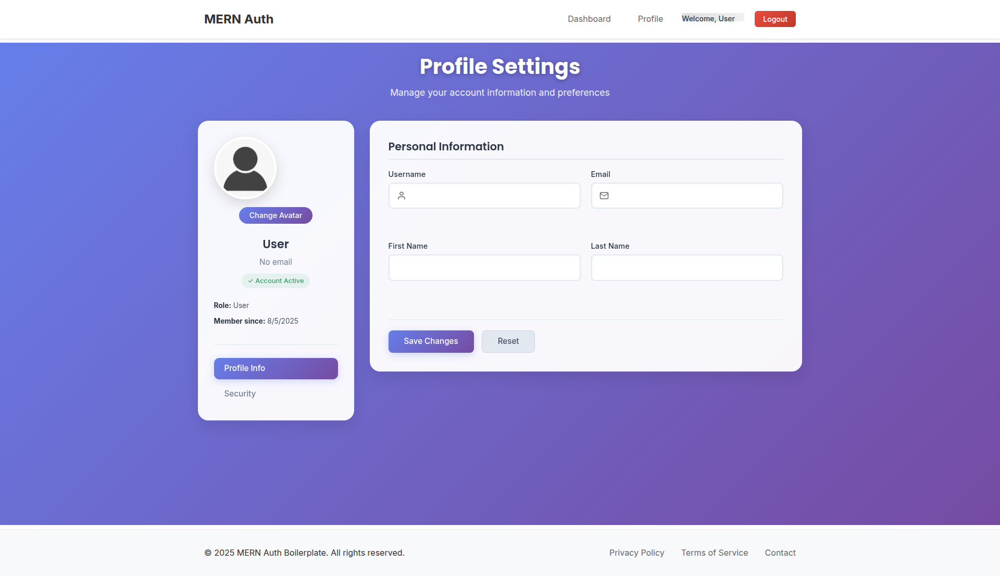
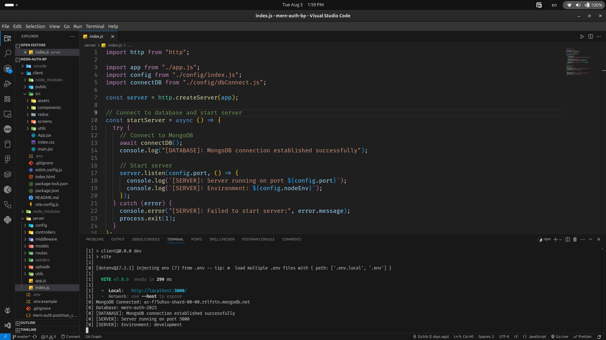
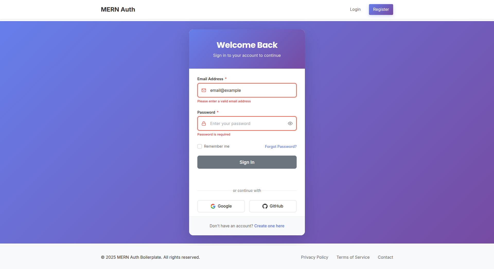
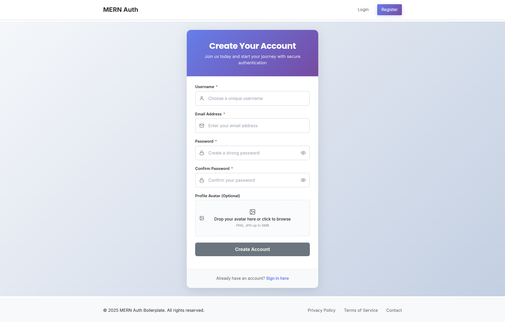

# MERN Auth Application

A scalable and modular full-stack authentication system built with the **MERN stack**, **Redux Toolkit**, and **HTTP-only JWT-based authentication**. The app is ready for extension with features like role-based access control (RBAC), file uploads, monitoring/auditing, and robust error handling.

---

## 🔥 Features

- MERN Stack (MongoDB, Express.js, React.js, Node.js)
- Redux Toolkit for state management
- Role-Based Access Control (RBAC)
- HTTP-only Cookies and JWT for secure authentication
- Ready-to-extend for:
  - File uploading
  - Monitoring & auditing
  - Error handling & logging
- Postman documentation included
- Screenshots included
- Single repo (monorepo): `client/` and `server/` folders
- Easily configurable via `.env` files

---

## 🌐 Live Demo

[Live Demo Link](https://your-deployment-url.com) – _Update this after deployment_

---

## 📁 Folder Structure

```bash
root/
├── client/            # Frontend (React + Vite + Redux Toolkit)
├── server/            # Backend (Node.js + Express)
├── screenshots/       # UI screenshots
├── .env               # Environment variables (server)
├── .env.local         # (optional) Local env overrides
├── postman_collection.json
└── README.md
```

---

## 🚀 Quick Start

### Prerequisites

- Node.js (v18+ recommended)
- MongoDB instance (local or cloud like Atlas)

---

## 🛠️ Installation

Clone the repository:

```bash
git clone https://github.com/your-username/mern-auth.git
cd mern-auth
```

Install all dependencies:

```bash
npm run install
```

---

## ⚙️ Environment Variables

Create a `.env` file in the `server/` folder with the following variables:

```env
PORT=5000
MONGO_URI=your_mongodb_connection_string
JWT_SECRET=your_jwt_secret
CLIENT_URL=http://localhost:5173
NODE_ENV=development
```

Optionally, you can also configure variables for third-party services (e.g., email, cloud storage).

---

## 📦 Available Scripts

### Root Level Scripts

| Script               | Description                              |
| -------------------- | ---------------------------------------- |
| `npm start`          | Runs the production server only          |
| `npm run dev`        | Runs both client and server concurrently |
| `npm run dev:server` | Runs the backend using Nodemon           |
| `npm run dev:client` | Runs the Vite development server         |
| `npm run seeders`    | Runs DB seeders                          |
| `npm run install`    | Installs dependencies in both folders    |
| `npm run build`      | Builds the React frontend                |

---

### Client Scripts (`client/`)

| Script            | Description                          |
| ----------------- | ------------------------------------ |
| `npm run dev`     | Starts the Vite development server   |
| `npm run build`   | Builds the production-ready frontend |
| `npm run preview` | Preview the production build         |
| `npm run lint`    | Run ESLint for linting the codebase  |

---

## 📸 Screenshots

| Page      | Screenshot                                |
| --------- | ----------------------------------------- |
| Home      |            |
| Dashboard |  |
| Profile   |      |
| Editor    |        |
| Login     |          |
| Register  |    |

---

## 🧪 Postman Collection

A complete Postman collection is included to help you test authentication routes and protected resources.

- File: `postman_collection.json`
- Import it into Postman and set the base URL to: `http://localhost:5000/api`

---

## ✅ Technologies Used

### Frontend

- React 19
- Vite
- Redux Toolkit
- Axios
- React Router v7
- React Hook Form
- React Toastify
- Redux Persist

### Backend

- Node.js
- Express.js
- MongoDB & Mongoose
- JWT Authentication (HTTP-only cookies)
- Custom error handlers and middleware
- Seeders for test users/roles

---

## 🛡️ Security Notes

- HTTP-only cookies are used to store tokens to prevent XSS
- CSRF protection can be implemented as needed
- JWT secret is stored securely in `.env`

---

## 📌 To Do / Extend

- ✅ Add RBAC (Role-Based Access Control)
- 🔜 Add file uploads (Multer or Cloudinary)
- 🔜 Add auditing logs (user actions tracking)
- 🔜 Add admin dashboard with advanced logs
- 🔜 Add localization and accessibility features

---

## 📬 Contact

Created by [Your Name](https://github.com/your-username).  
Feel free to contribute, open issues, or fork!

---

## 📝 License

This project is licensed under the MIT License.
